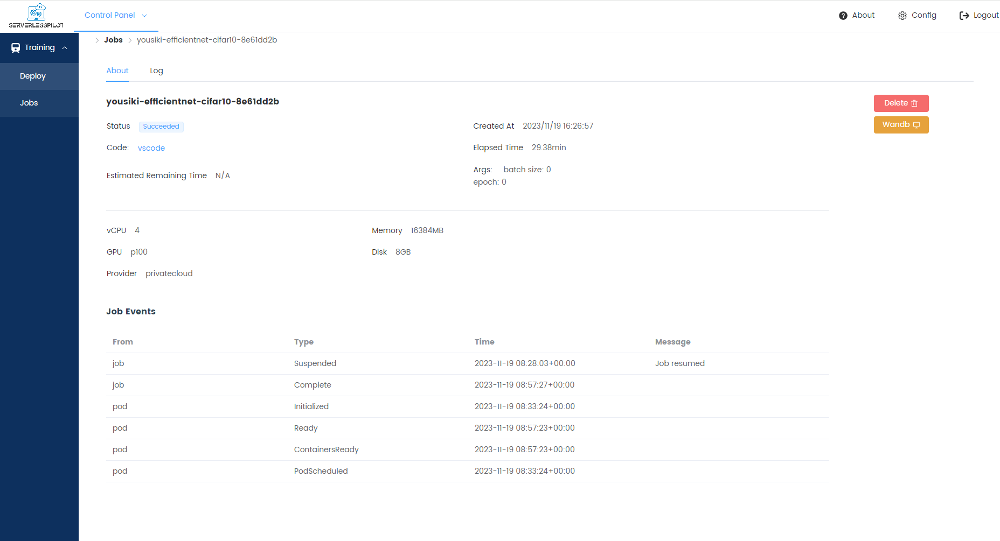

# DML-Homework 1

## Introduction

Train efficientnet on CIFAR10 at wecloud with minimal code.

## Usage

Build docker image and upload to dockerhub. Otherwise, replace `image` in `efficientnet-cifar10/.spilot.yaml` to `pytorch/pytorch:latest`.

```bash
docker buildx build -t yousiki/wecloud:latest efficientnet-cifar10
docker push yousiki/wecloud:latest
```

Upload code to wecloud platform.

```bash
docker run --rm -it -v $(pwd):/workspace yousiki/wecloud python -m wecloud-cli.main deploy --path efficientnet-cifar10
```

Submit training jobs with WebUI.

## Experiments

Normal training job succeesfully finished.



ElasticFlow training job submitted but not found in _Jobs_ list. Profiling succeeded.
